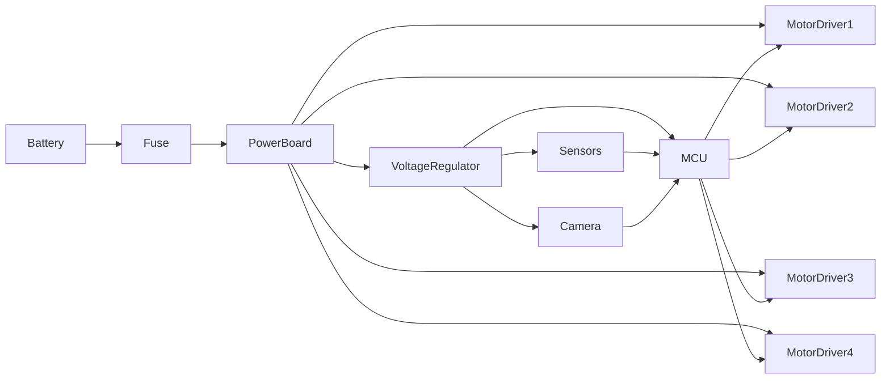

```mermaid
flowchart LR

Battery --> Fuse
Fuse --> PowerBoard

PowerBoard --> MotorDriver1
PowerBoard --> MotorDriver2
PowerBoard --> MotorDriver3
PowerBoard --> MotorDriver4

PowerBoard --> VoltageRegulator

VoltageRegulator --> MCU
VoltageRegulator --> Sensors
VoltageRegulator --> Camera

MCU --> MotorDriver1
MCU --> MotorDriver2
MCU --> MotorDriver3
MCU --> MotorDriver4

Sensors --> MCU
Camera --> MCU
```
